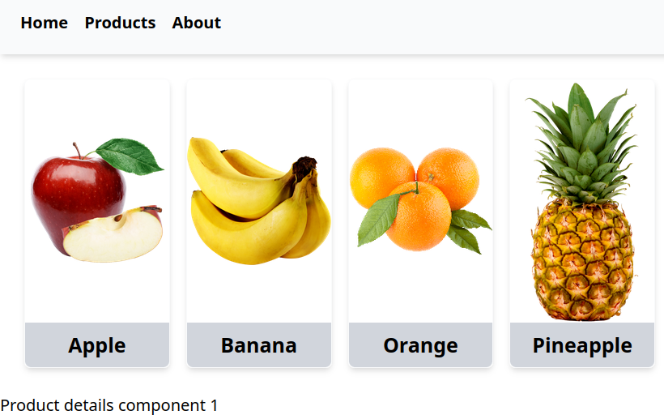

# 6. React Router

## Introduction to routing

- **Routing Concept**: Routing allows accessing different pages of an application based on the URL path.
- **URL Parameters**: The URL parameters change to reflect the different pages being accessed, such as `/learn` or `/blog`.

## Configure routes using React Router

- **Installation**: Install the react-router library using `npm install react-router`.
- **BrowserRouter Component**: Wrap the top-level component with the `BrowserRouter` component to enable routing throughout the application.

```
const root = ReactDOM.createRoot(
  document.getElementById('root') as HTMLElement
);
root.render(
  <React.StrictMode>
    <BrowserRouter>
      <App />
    </BrowserRouter>
  </React.StrictMode>
);
```

- **Routes Configuration**: Use the Routes component to define individual routes with the Route component, specifying the path and the corresponding component to render.
- **Path Matching**: Ensure the path in the Route component matches the URL path for correct component rendering.

```
function App() {
  return (
    <div>
      <ul className="flex gap-4">
        <li><a href="/home">Home</a></li>
        <li><a href="/products">Products</a></li>
        <li><a href="/about">About</a></li>
      </ul>
      <hr />
      <Routes>
        <Route path="/home" element={<Home />} />
        <Route path="/products" element={<Products />} />
        <Route path="/about" element={<About />} />
      </Routes>
    </div>
  );
}
```

## Understanding single-page (SPA) applicaiton and multi-page application

- **Multi-Page Application (MPA)**: In MPAs, navigating to a new page sends a request to the server, which responds with a new HTML page, causing the entire page to reload.
- **Single-Page Application (SPA)**: SPAs allow navigation without refreshing the entire page, resulting in a smoother user experience. This is achieved using the React Router Library.
- **React Router**: To implement SPA, replace anchor tags with the `Link` component from React Router, which uses the `to` attribute instead of `href`.
- **BrowserRouter Component**: Wrapping the entire app inside the `BrowserRouter` component enables React Router to keep track of URL changes and navigation history.

```
function App() {
  return (
    <div>
      <ul className="flex gap-4">
        <li>
          <Link to="/">Home</Link>
        </li>
        <li>
          <Link to="/products">Products</Link>
        </li>
        <li>
          <Link to="/about">About</Link>
        </li>
      </ul>
      <hr />
      <Routes>
        <Route path="/" element={<Home />} />
        <Route path="/products" element={<Products />} />
        <Route path="/about" element={<About />} />
      </Routes>
    </div>
  );
}
```
## Not found page (404)

- **Creating a 404 Not Found Component**: Create a `notfound.tsx` file and define a component that returns the text '404 Not Found'.
- **Configuring the Route**: In `app.js`, use the Route component with the path attribute set to an asterisk (`*`) to catch all invalid URLs and render the Not Found component.
- **Wildcard Character**: The asterisk (`*`) acts as a wildcard to match any URL that doesn't match other defined routes. 
```
<Route path="*" element={<NotFound />} />
```

## Dynamically handling nested routes: Route parameter

- **Dynamic Routes**: Use dynamic routes to handle multiple products by using the asterisk (*) or route parameters (e.g., `/product/:productName`).
- **Route Parameters**: Replace static paths with route parameters to dynamically capture URL segments (e.g., `/product/:id)`.
- **useParams Hook**: Utilize the `useParams` hook from React Router to extract and use route parameters within components.
- **Rendering Components**: Configure routes to render the appropriate component based on the dynamic URL segment. 

## Layout: Outlet/component

- **Common Layout**: This part explains how to create a common layout for product detail pages, ensuring that the product list remains visible while displaying product details below the product cards.
- **Parent and Child Routes**: The products component is set as a parent route, and the product details component is nested as a child route.
- **Outlet Component**: Use the Outlet component from React Router to render child components within the parent component.
- **Persistent Interface**: The layout ensures that the product cards are persistent even when navigating to the product detail route.

```
function Products() {
  return (
    <div>
      <h1>Products</h1>
      <Outlet />
    </div>
  );
}
```
```
function App() {
  return (
    <Router>
      <Routes>
        <Route path="/" element={<Home />} />
        <Route path="/about" element={<About />} />
        <Route path="/products" element={<Products />}>
          <Route path=":id" element={<ProductDetails />} />
        </Route>
      </Routes>
    </Router>
  );
}
```
## index attribute: Referring the parent route

- **Nested Routes**: The video explains how to configure nested routes, where subroutes are defined within a main route.
- **Root Route**: All routes should be children of the root route (`/`).
- **Index Route**: Use the `index` attribute to point to the parent route by default.
- **Persistent Layout**: Ensure that components like product cards remain visible by assigning them to the parent route component. 
```
<Routes>
  <Route path="/">
    <Route index element={<Home />} />
    <Route path="/products" element={<Products />}>
      <Route path=":id" element={<ProductDetails />} />
    </Route>
    <Route path="/about" element={<About />} />
    <Route path="*" element={<NotFound />} />
  </Route>
</Routes>
```

## Passing data to child component

- **useOutletContext Hook**: The `useOutletContext` hook is used in the child component to fetch the data passed through the context attribute.
```
import { Outlet } from 'react-router-dom';
import { useOutletContext } from 'react-router-dom';

// Parent Component
const ParentComponent = () => {
  const products = [/* your products data */];
  return (
    <div>
      <Outlet context={products} />
    </div>
  );
};

// Child Component
const ChildComponent = () => {
  const products = useOutletContext();
  return (
    <div>
      {/* Use the products data here */}
    </div>
  );
```

