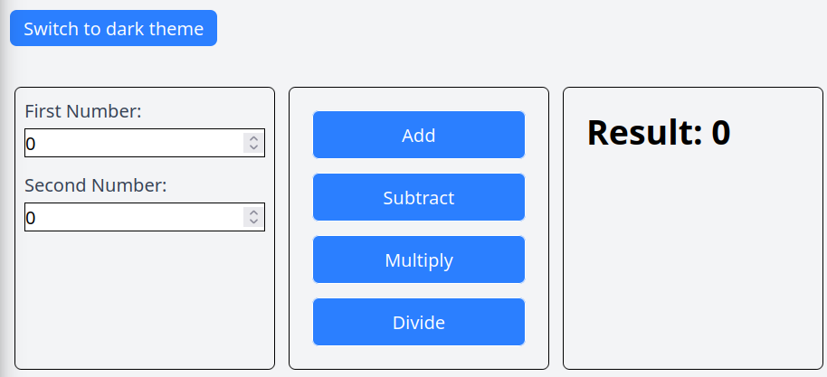

# 8. Redux Tool Kit (RTK): Advanced Global State Handling

## Introduction to Redux and RTK
- **Context API vs Redux**: The video explains that while the Context API is useful for managing global state, it can become complex with large applications. Redux offers a more predictable and centralized way to manage global state.
- **Redux Structure**: Redux uses a single global store with reducers for each data set, making it easier to debug, test, and scale applications.
- **Redux Toolkit**: The Redux Toolkit simplifies Redux configuration, reducing boilerplate code and making the overall coding experience better. It introduces functions like configureStore and slices to streamline the setup and usage of Redux.
- **Practical Implementation**: The video demonstrates installing Redux Toolkit and React Redux, and sets the stage for implementing global state management with Redux Toolkit in the next lecture. 

    | Redux | ContextAPI |
    |-------|------------|
    |For global state management in complex apps| For Simpler state sharing to avoid prop drilling|
    |Requires more boilerplate code | Easier & quicker to implement |
    |USes the centralized global store | Allow decentralized state management|
    |Optimizes re-renders with the selective updates | Causes unneessary re-renders for all the consumer components|

## Creating a slice

- **Creating a Slice**: Slice is basically a feature or approach of RTK which is used to organize the redux logic. This involves setting the name, initial state, and reducers for the slice.
  ```
  import { createSlice } from '@reduxjs/toolkit';
  
  const sliceName = createSlice({
    name: 'sliceName',
    initialState: initialStateValue,
    reducers: {
      // Define your reducers here
      actionName: (state, action) => {
        // Update the state
      }
    }
  });
  
  export const { actionName } = sliceName.actions;
  export default sliceName.reducer;
  ```

  ## Configure store

- **Configuring the Store**: The store is a global state that contains all the data configured in Redux. It is configured using the `configureStore` method from the Redux Toolkit library.
  ```
  import { configureStore } from '@reduxjs/toolkit';
  const store = configureStore({
    reducer: {
      theme: themeReducer,
      // Add other reducers here
    }
  });
  ```
- **Providing the Store**: The store is provided to the entire app using the `Provider` component from `react-redux`, making the Redux store available to all child components.
  ```
  ReactDOM.render(
    <Provider store={store}>
      <App />
    </Provider>,
    document.getElementById('root')
  );
  ```
## Create actions in a slice

- **Creating Actions**: Functions declared as reducers inside a slice.
  ```
  import { createSlice } from '@reduxjs/toolkit';
  
  const themeSlice = createSlice({
    name: 'theme',
    initialState: 'light',
    reducers: {
      toggleTheme: (state) => (state === 'light' ? 'dark' : 'light')
    }
  });
  
  export const { toggleTheme } = themeSlice.actions;
  export default themeSlice.reducer;
  ```
- **Dispatching Actions**: To dispatch actions using the useDispatch hook, which is necessary to call actions in Redux.
  ```
  import React from 'react';
  import { useDispatch } from 'react-redux';
  import { toggleTheme } from './themeSlice';
  
  const ThemeToggleButton = () => {
    const dispatch = useDispatch();
  
    return (
      <button onClick={() => dispatch(toggleTheme())}>
        Toggle Theme
      </button>
    );
  };
  
  export default ThemeToggleButton;
  ```
- **Immutability**: Redux Toolkit handles immutability behind the scenes, allowing you to update the state directly without worrying about mutability.

## How immutability in actions works behind the scenes

- **Immutability in Redux**: Redux state is immutable, meaning it cannot be changed directly. Instead, a new state object must be created each time the state is updated.
- **Immer Library**: Redux Toolkit uses the `Immer` library to handle immutability behind the scenes. This allows you to write code that looks like it mutates the state, but actually produces a new immutable state.
- **Cleaner Code**: Using Immer makes the code cleaner and easier to read while ensuring the immutable approach is implemented.

## Practice Project

Calculator app implemented using RTK